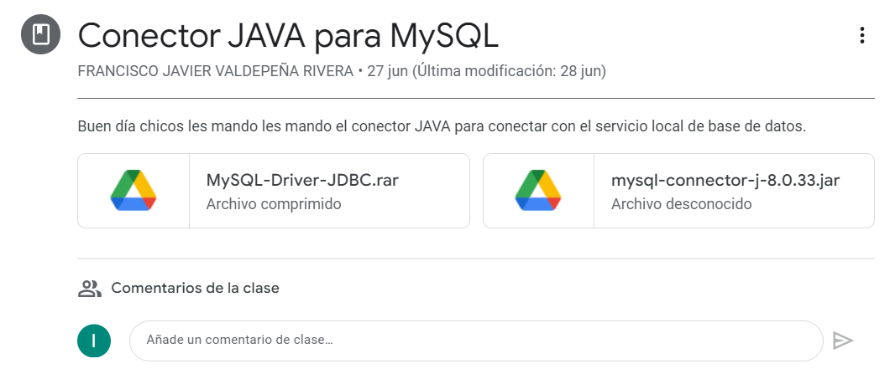
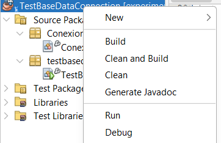
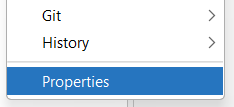
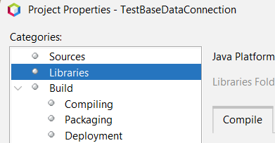
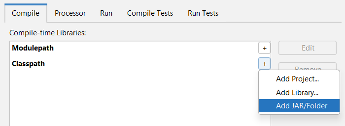
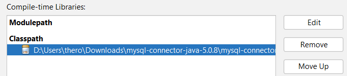
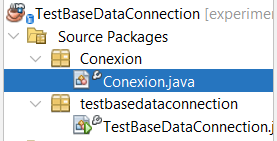
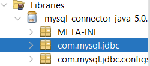
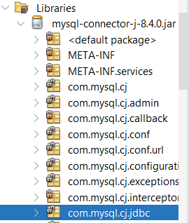

# CÓMO CREAR UNA CONEXIÓN A UNA BASE DE DATOS CON JAVA

## ÍNDICE

- [CÓMO CREAR UNA CONEXIÓN A UNA BASE DE DATOS CON JAVA](#cómo-crear-una-conexión-a-una-base-de-datos-con-java)
  - [ÍNDICE](#índice)
  - [DESCARGAR E INSTALAR EL DRIVER](#descargar-e-instalar-el-driver)
  - [CONFIGURACIÓN DEL CONTROLADOR. CLASE `Conexion`](#configuración-del-controlador-clase-conexion)
    - [Método JavaToSQL](#método-javatosql)
      - [`Class.forName`](#classforname)
      - [`Connection info`](#connection-info)
      - [`DriverManager.getConnection`](#drivermanagergetconnection)
    - [El Resto De Las Variables](#el-resto-de-las-variables)
  - [CLASE MAIN (`TestBaseDataConnection`)](#clase-main-testbasedataconnection)


<br>

## DESCARGAR E INSTALAR EL DRIVER

Primero, necesitamos descargar el driver Java que nos permitirá usar comandos de MySQL con código Java.

El profesor nos proporciona dos versiones diferentes del driver, 5.0.8 y 8.0.33 (o puedes buscarlo en internet). Cualquiera que elijas está bien, esto solo cambia una línea de código de la configuración del driver (lo veremos más adelante). No es gran cosa.



Una vez que hayas terminado, es hora de cargar ese driver en tu proyecto de NetBeans. Puedes hacerlo de la siguiente manera:

1. Haz clic derecho en tu proyecto



2. Luego haz clic en 'propiedades'



3. Selecciona la categoría 'Bibliotecas'



4. Y en la opción 'Classpath', selecciona el archivo .JAR que acabas de descargar <sup>1</sup>

 **Nota 1:** el archivo . JAR puede estar dentro de la carpeta que descargaste



5. ¡El driver está cargado!, ahora cierra la ventana.



<br>
<br>

(Regresar al [índice](#índice))

<br>

## CONFIGURACIÓN DEL CONTROLADOR. CLASE `Conexion`

Ahora es el momento de configurar el controlador para obtener acceso a una de nuestras Bases de Datos (BD). Así que necesitaremos especificar información como puerto, nombre de BD, usuario, contraseña, etc.

Esa información se almacenará en nuestro método `JavaToSQL` (de la clase `Conexion`).



### Método JavaToSQL

#### `Class.forName` 

Esta línea carga el driver. Lo que estamos haciendo aquí es literalmente decir qué clase vamos a usar (esto debe hacerse ya que estamos usando una biblioteca externa).

**Nota**: Esta línea de código depende de qué versión del controlador estemos usando, porque el la "dirección de la clase" es diferente.

```java

    Class.forName("com.mysql.jdbc.Driver"); // 5.0.8 Driver version

```




o

```java
    
    Class.forName("com.mysql.cj.jdbc.Driver"); // 8.4 Driver version

```


#### `Connection info`

Aquí solo configuramos la información de la BD en **Strings**.

```java

    String servidor = "jdbc:mysql://localhost:3307/practica1";

```

- `jdbc:mysql://` -> El nombre del driver
- `localhost:` -> La dirección IP
- `3307` -> La dirección del puerto (usualmente 3306)
- `practica1` -> El nombre de la BD


```java

    String usuario = "root";
    String password = "";

```

#### `DriverManager.getConnection`

En esta parte necesitamos algunas bibliotecas, `import java.sql.Connection` y `import java.sql.DriverManager` para ser más específicos.

*Connection* se usa para nuestra variable `conexion`. Este es nuestro puente entre Java y MySQL.

```java
    public Connection conexion = null;
```

En este ejemplo, nuestra variable es pública ya que la usaremos en nuestra clase principal.

---
<br>

Y usamos un método de *DriverManager* para obtener la conexión con la información de conexión que acabamos de configurar:

```java
    conexion = DriverManager.getConnection(servidor, usuario, password);
```

Y eso es prácticamente todo de este método.

<br>

### El Resto De Las Variables

En esta clase tenemos dos variables más: `comando` y `registro`. Cada una requiere su propia declaración de importación: `import java.sql.Statement` e `import java.sql.ResultSet`.

```java

    public Statement comando = null;
    
    public ResultSet registro;

```

- `comando`: Usaremos esta para enviar comandos SQL a nuestra BD.
- `registro`: Y esta es para guardar nuestros resultados de los comandos SQL.

<br>
<br>

(Regresar al [índice](#índice))

<br>

## CLASE MAIN (`TestBaseDataConnection`)

Dentro de nuestro `try-catch`, creamos una variable de tipo *Conexion*:

```java
    Conexion conector = new Conexion();
```

Ahora llamamos a nuestro método `JavaToSQL`. Si recuerdas, esto cargará nuestra variable "conexion" con DriverManager.getConnection. Así que si funciona, conexion ya no será `null` y estará lista para usarse; de lo contrario, irá al catch.

```java
    conector.JavaToMySQL();
```

Luego, preparamos nuestra consulta con Strings.

```java
    String tabla = "persona";
    String query = "select * from "+tabla;  
```

También preparamos la variable "*comando*". Como vimos antes, es `null`, pero no podemos trabajar con nulls, así que creamos un objeto Statement usando `createStatement()`.

```java
    conector.comando = conector.conexion.createStatement();
```

Y ejecutamos la consulta. El resultado de la consulta se guardará en nuestra variable "*registro*".

```java

    conector.registro = conector.comando.executeQuery(query);

```

Finalmente, imprimimos nuestros resultados. `getString(columnIndex)` recupera el valor de la columna designada.

```java
    while(conector.registro.next()){
            System.out.println(conector.registro.getString(1)+" "+conector.registro.getString(2)+" "+conector.registro.getString(3));
        }
```

Y eso es todo.

<br>
<br>

(Regresar al [índice](#índice))

<br>